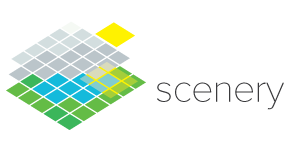

  

 
 
 
// 

 
 
  

# scenery  // Flexible VR Visualisation for Volumetric and Geometric Data on the Java VM

[BloodCellsExample](./src/test/kotlin/graphics/scenery/tests/examples/advanced/BloodCellsExample.kt) / [scenery running on a CAVE](./src/test/kotlin/graphics/scenery/tests/examples/cluster/DemoReelExample.kt) with a scientist exploring a Drosophila melanogaster microscopy dataset / [Adaptive Particle Representation](https://www.nature.com/articles/s41467-018-07390-9) rendering of Zebrafish head vasculature / [Rendering six different out-of-core volumes from two datasets in a single scene](./src/test/kotlin/graphics/scenery/tests/examples/bdv/BDVExample.kt) / VR interaction with microscopy data in realtime

## Synopsis

scenery is a scenegraphing and rendering library. It allows you to quickly create high-quality 3D visualisations based on mesh data. scenery contains both a OpenGL 4.1 and Vulkan renderer. The rendering pipelines of both renderers are configurable using YAML files, so it's easy to switch between e.g. [Forward Shading](./src/main/resources/graphics/scenery/backends/ForwardShading.yml) and [Deferred Shading](./src/main/resources/graphics/scenery/backends/DeferredShading.yml), as well as [stereo rendering](./src/main/resources/graphics/scenery/backends/DeferredShadingStereo.yml). Rendering pipelines can be switched on-the-fly.

Both renderers support rendering to head-mounted VR goggles like the HTC Vive or Oculus Rift via [OpenVR/SteamVR](https://github.com/ValveSoftware/openvr).

## Visit our wiki for additional info:

- [how to build](Building)
- [how to cite](Citation), for scientific publications
- [docs](Documentation)
- [examples](Examples)
- [gpu compatibility table](GpuCompatibility), per GPU and OS
- [how to import Scenery](Importing)
- [key bindings](KeyBindings)
- [logging](Logging)
- [renderer selection](Renderer)